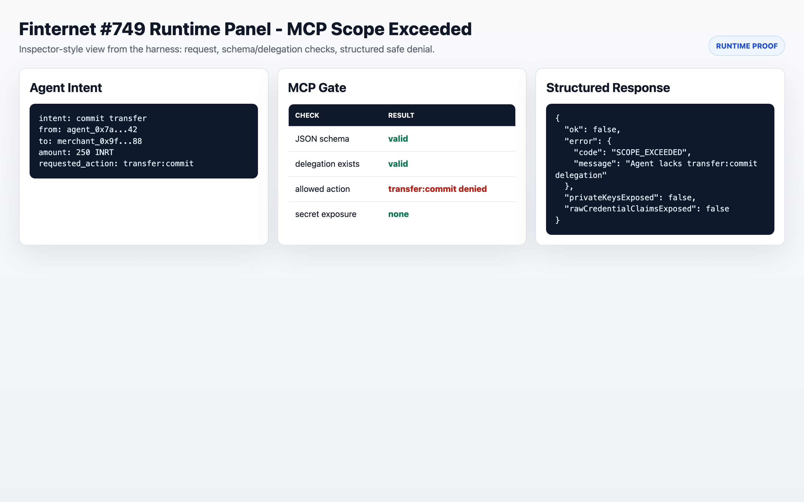
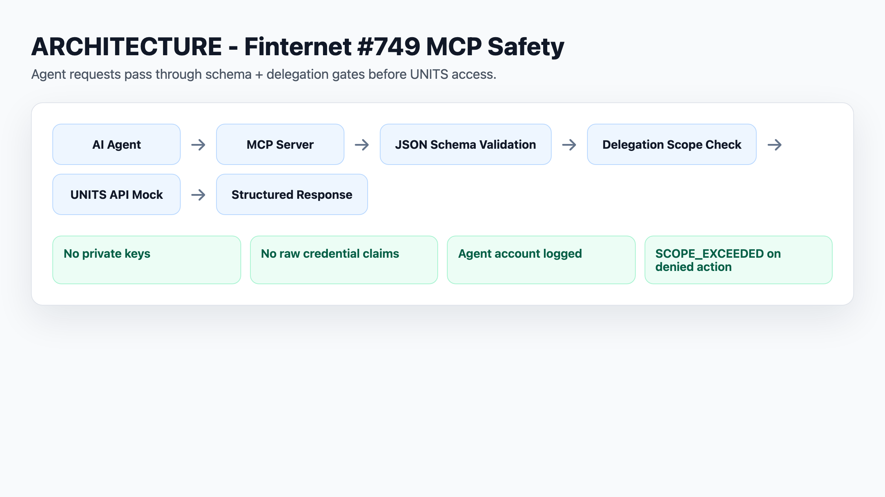
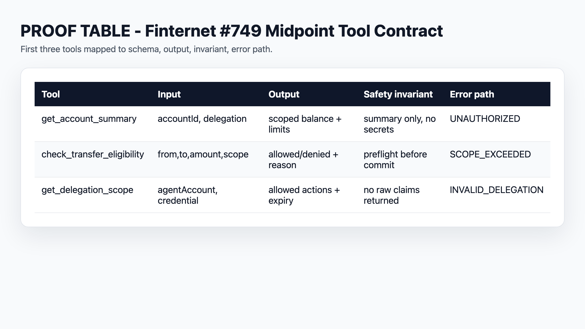

# Finternet #749 proof packet

Status: proposal-facing proof. Not a private MCP server implementation.
Date: 2026-05-03.

## Start Here - Strongest Proof

**`MCP_SAFETY_PROOF.md`** - Terminal output proving SCOPE_EXCEEDED blocks over-delegation correctly. Run `node run-mcp-harness.mjs` to regenerate.

## What this proves

This packet shows how I would turn issue #749 into concrete MCP contracts before touching the private server repo:

- public Finternet API specs mapped to MCP exposure decisions,
- six issue-named tools shaped as JSON contracts,
- success and failure responses for delegation-scoped workflows,
- structured safety errors such as `SCOPE_EXCEEDED`,
- MCP Inspector workflow plan for post-repo-access validation,
- synthetic MCP transcript showing tool-call behavior without private repo access,
- static MiFi simulator for agent request -> MCP tool -> structured response.

## What this does not prove

- No access to the private UNITS MCP server is claimed.
- No real UNITS transfer is executed.
- No Docker Compose UNITS dev-instance test has been run yet.
- No production MCP server code is included.

## Backend boundary modeled

```text
Tool schema
  -> input validation
  -> auth/delegation guard
  -> UNITS API adapter
  -> domain error mapper
  -> response redactor
  -> audit logger
```

The MCP server should be an adapter. UNITS should remain the authority for account state, delegation checks, policy evaluation, credentials, transaction execution, and lifecycle events.

## How to inspect

1. Read `api-to-mcp-audit-matrix.md`.
2. Check `tool-schemas/check_transfer_eligibility.schema.json`.
3. Compare `examples/eligibility-pass.response.json` and `examples/scope-exceeded.response.json`.
4. Open `index.html` locally for the MiFi workflow simulator.
5. Read `mcp-inspector-test-plan.md` for validation after repo/dev access.
6. Read `synthetic-mcp-transcript.md` for labeled proposal-side tool-call examples.
7. Run `node run-mcp-harness.mjs` to regenerate `mock-mcp-runtime-output.json`. This is a local MCP-style harness, not the private MCP server. It proves schema-gated preflight behavior and a structured `SCOPE_EXCEEDED` response.

## Files

| File | Purpose |
|---|---|
| `api-to-mcp-audit-matrix.md` | Public spec -> MCP exposure decisions. |
| `public-spec-surface-inventory.md` | Live `finternet-io/specs` API/schema inventory mapped to the audit matrix. |
| `tool-schemas/*.schema.json` | Input schemas for all six tools named in issue #749. |
| `tool-schemas-output/*.output.schema.json` | Output and error schemas for all six tools. |
| `examples/*.json` | Synthetic success/failure responses. |
| `mcp-inspector-test-plan.md` | Test workflows to run after repo/dev access. |
| `synthetic-mcp-transcript.md` | Labeled synthetic tool-call transcript for reviewer understanding. |
| `index.html` | Static MiFi simulator. |

## Public source basis

- Issue: https://github.com/Code4GovTech/C4GT/issues/749
- Specs: https://github.com/finternet-io/specs
- Relevant public surfaces: account, delegation, token, key-management, credential, and transaction specs.

<!-- C4GT_VISUAL_SCREENSHOTS_START -->
## Visual Proof Screenshots

Generated reviewer-facing PNGs. Runtime/prototype screenshots lead each project; architecture and proof tables remain supporting evidence. Prototype images do not expand the verified implementation boundary.

### Runtime proof: MCP inspector-style SCOPE_EXCEEDED denial.



Path: `screenshots/runtime-mcp-inspector-scope-exceeded.png`

### Architecture: agent -> MCP -> schema -> delegation -> UNITS mock.



Path: `screenshots/mcp-safety-architecture.png`

### Tool contract table for first three midpoint tools.



Path: `screenshots/mcp-tool-contract-table.png`
<!-- C4GT_VISUAL_SCREENSHOTS_END -->
